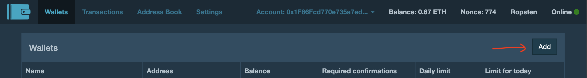
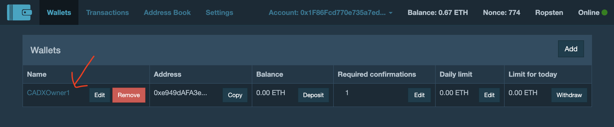
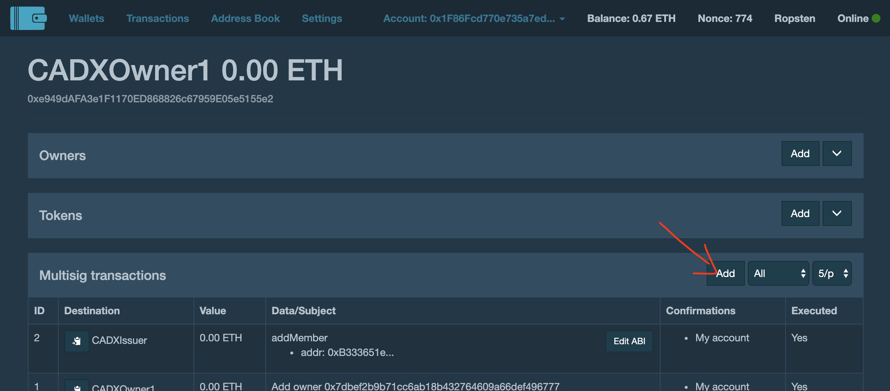
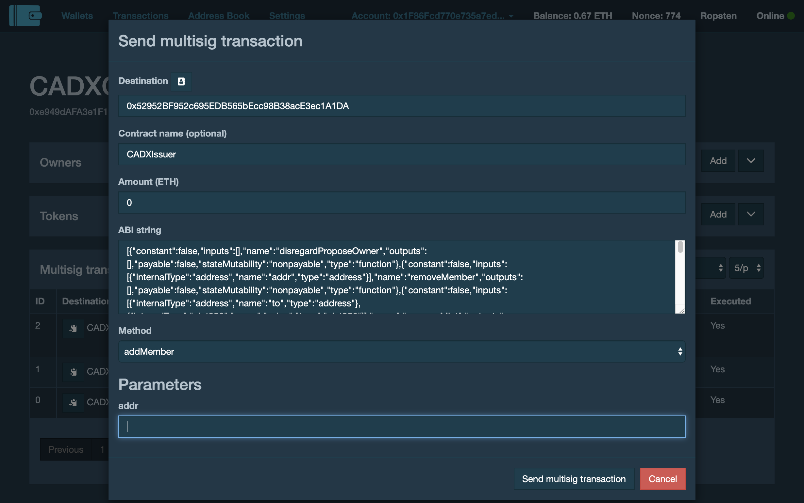

# Governance Playbook

## Overview
CADX governance is orchestrated via a smart contract multisign mechansim. Specifically we will use the most battletested implementation from Gnosis [https://github.com/gnosis/MultiSigWallet](https://github.com/gnosis/MultiSigWallet). Stably has deployed an instance of the UI for convenience, it can be found at [https://gnosis-multisig.stably.io](https://gnosis-multisig.stably.io)

The multisig wallet will be responsible for governance of both the token as well as the issuance mechanism, though this is not necessary, it is more convenient. There will be a separate account for governing the proxy itself, this is a requirement by design, as the proxy owner cannot call any token functions (including token governance functions).

## Important Addresses
| Entity                                 | Address                                    |
| -------------------------------------- | ------------------------------------------ |
| Token (Proxy)                          | 0xfaAc3113CeE77B4caEf48ccbF60A89BcC07f333e |
| Token Implementation (do not interact) | 0x7fd647DC32c030D2c17B33971018E507385F3ADb |
| Issuer                                 | 0xb316CF21Ef0CE86420Ca62CC701211078db0F577 |
| Token & Issuer Owner Multisig          | 0x9Ff86cafAB153C20225Bc0d228ED8C7f18aC5E43 |
| Proxy Owner                            | 0x8540dB49D7b6A38D8d2e70625B33234D206d676D |

## How to Use
### Register the multisig wallet in the UI
Click on "Add" to add an existing multisig wallet deployed on-chain.

The multisig wallet should show up in the UI with some basic information.

### View the multisig wallet
Click on the wallet name to go to the wallet's page.

### Create a new multisig transaction
Click "Add" under the "Multisig transactions" section.

Fill in the information. You will only need to fill this in once per address, in the future when you specify the address it will load the ABI last used at that address.

Make sure you select the correct "Method" and fill in the parameters. On the next page you can set a custom gas price and then confirm the transaction for broadcast.

Once the multisig transaction is created, if the multisig condition is not satisifed yet it will sit in the queue until enough multisig owners have approved the transaction.

## Governance Functions

### Token
#### Appointing a new owner
Only the current owner can appoint a new owner. If we ever want to switch governance mechanism we will have to migrate to a new governer this way.

Once a new owner is appointed the new owner must accept the appointment before the transfer is complete.

#### Setting a new Issuer
The owner can set the single address which can mint tokens. In our case this will be the Issuer smart contract, but this is flexible and could be anything as long as it can call the appropriate functions. If we ever want to switch issuance mechanism we will use this function.

#### Emergency global pause
If there is ever a need to pause transfers globally only the owner can invoke such functionality.

#### Setting a compliance agent
If there is ever a requirement to freeze and sieze tokens as required by law enforcement, the owner can appoint an account with those permissions.

### Issuer
#### Appointing a new owner
Like the token, the Issuer also has a propose and accept ownership transfer model.

#### Adding a new Issuer member
The owner of the Issuer itself cannot mint tokens by default. The owner must add authorized Issuer members who can propose, reject, and send mint transacions to the token.

#### Changing the token the Issuer is responsible for
The Issuer can be repurposed to mint any token with the correct mint function signature. The most likely usecase is to deprecate an Issuer to avoid confusion.

#### Set the minimum blocks to wait for mint proposals
The minimum blocks required for a mint proposal to be sent can be set by the owner.
